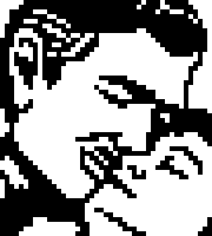
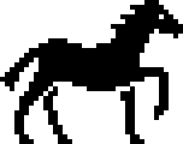

## Parallel Nonogram Solver

Team members: Sean Xiao (ssx), Nicholas Mu (nhmu)

### Summary:
Out team implemented a parallel and sequential nonogram solver using OpenMP that runs on the GHC machines. Our parallel solver achieves notable speedup over the sequential version, particularly when moving from one to two threads.
#### How to run:
Compile with `make` and run `./nonogram_solver LINK_TO_PUZZLE.txt` for the parallel implementation or `./nonogram_solver_ref LINK_TO_PUZZLE.txt` for the sequential version. The number of threads can be set by modifying `NUM_THREADS` in para.cpp.

### Implementation:
Our algorithm for nonogram solving consists of an iterative line-solving portion where we try to solve as much of the puzzle as we can using only logical rules for each line. When the line solver can't make any more progress, we make a guess for a particular clue and then try line solving again. If a contradiction occurs, we backtrack and change our guess and try again. Otherwise, we keep going, making guesses whenever the line solver stalls. The potential guesses we can at each point make form a tree, which we traverse using DFS.

We have two main data structures, a pixel array that corresponds to the output image and a data structure of run structs, which keeps track of the start/end bounds and length of each 'run' in the puzzle. By progressively filling in the pixel array (which is initialized to all UNKNOWN) and updating the possible start and end boundaries of each run over each iteration, the algorithm is able to narrow down the exact positions of each run and solve the puzzle.

In the guessing portion of the algorithm, we create states corresponding to these data structures and use a stack-based DFS implementation to traverse the different possible choices.

### Approach
We decided to parallelize the line solving portion of the algorithm because we can apply the logical rules to each row separately, since this does not rely on the data for any of the other rows (and the same applies for columns). This allows us to parallelize over the rows and columns, which we accomplished using an OpenMP parallel construct and an interleaved assignment.
```C++
#pragma omp parallel num_threads(NUM_THREADS)
{
  int tid = omp_get_thread_num();
  for (int i = tid; i < height; i += NUM_THREADS) { line solve row i }
  #pragma omp barrier
  for (int i = tid; i < width; i += NUM_THREADS) { line solve column i }
}
```
We line solve rows and then columns to eliminate most of the synchronization requirements (since columns touch the data for the rows and vice versa). This approach gave us decent speedup, but we made many optimizations to the sequential and parallel algorithm which are discussed in the Results.


### Results:
We measured performance through speedup by testing on various nonograms using 1, 2, 4, and 8 threads on the GHC machines. Our results for six of the puzzles are seen here:

<br>
 
<br>
<div>






</div>

We timed the parallel portion and found that approximately 5% of the algorithm is sequential. According to Amdahl's Law, this entails a maximum speedup of about 5.9 on the 8-core GHC machines. There is almost perfect speedup from 1 to 2 threads, but this speedup falls off with more threads. One reasonable explanation is a lack of memory bandwidth which is consistent with our logical solving algorithmn. Our line solver uses many reads followed by a quick arithmetic comparision and then multiple writes, which leads to poor arithemtic intensity. We attempted to resolve this through various means. We first tried to reduce our memory requirements through modifying our data structures. We were able to cut our memory usage by 75% using a int8_t instead int for our data.  We also fused as many for loops as possible to improve data reuse and cut down on the number of reads. Furthermore, we read and write to local rather than global data to improve memory access times and remove any false sharing between column threads. These changes led to some modest speedup improvements.

#### Comparison to Existing Implementations
There were few references to parallel nonogram solvers online, but we found a Haskell implementation here: <https://jaspervdj.be/posts/2011-07-05-parallelizing-a-nonogram-solver.html>. We ran our solver against their test cases and found that our solver runs an order of magnitude faster (although the machines are different, their clock speed of 3.00 Ghz is similar) as well as achieving greater speedup on two threads (they only tested a dual core machine). We also found a previous 418 project that modified an existing, highly-optimized solver, but their speedup was not very great and in many cases led to a performance decrease. The only other parallel solver we were able to find was a Chinese slide presentation (<https://www.slideshare.net/ssuserd7f3cf/solving-nonograms-in-parallel>) which achieved 5.2x speedup using 10 cores, but it was difficult to compare because it is written in Chinese.

<div>


</div>

Comparing our test cases to a sequential solver, we see decent speedup on some test puzzles but also slowdown on others. This is most likely due to more advanced guessing tehcniques implemented by the solver. We believe that our solver would have been competitive on these cases had we used these techniques. 

#### Areas for improvement
Regarding overall execution time, there is room for improvement. Our DFS guessing algorithmn is very straightforward could have benefited from better heuristics or a probing approach. We more mostly focused on achieving parallel speedup so we did not devote much time to this. 

In hindsight, running our program on a GPU rather than CPU would likely have provided better results. A throughput-oriented GPU with much greater memory bandwidth would have alleviated some of our bandwidth problems. 

### References: 

Puzzle repository: <http://webpbn.com/pbnsolve.html> <br>
Nonogram solving techniques: Yu, Chiung-Hsueh, Hui-Lung Lee, and Ling-Hwei Chen. "An Efficient Algorithm for Solving Nonograms." Applied Intelligence 35.1 (2009): 18-31. Web.

### Work
Equal work was performed by both members.

<br><br><br><br><br><br><br><br>

## Proposal

### Background:
[Nonograms](https://en.wikipedia.org/wiki/Nonogram) are picture logic puzzles, usually on a 2-D grid, that when solved, produces a black/white pixel image, although there are also versions that produce images with a wider color palette.

Ex:


The numbers to the side of a particular row or above a particular column specify the number of contiguous blocks of color there are in that row or column, with contiguous blocks in the same row separated by at least one blank square.  In this example, the fourth row reads “2 2”, specifying that in the fourth row there are two contiguous blocks of black pixels with length 2 each, separated by (in this case) two white pixels.  Usually nonogram puzzles have a unique solution, and have no theoretical bounds on size.

There are other nonogram solver implementations online, but they are mostly sequential implementations.  We think that developing a parallel implementation (for example, working on several different sections of the image at the same time) may improve the runtime of finding a solution, particularly on larger image sizes.

### The Challenge:
There are many different algorithms and approaches to nonogram solving, and at this point our team is not too familiar with how these different algorithms work.  However, this means that there are many different ways to think about the problem apart from a simple naive or brute force solution.  It will be worthwhile for us to research these different approaches and analyze and identify points of parallelization for each in order for us to arrive at a solver that makes good use of parallel computing resources.

### Resources:
There are multiple online solvers that we plan on using to test our correctness against such as <http://a.teall.info/nonogram/>. We also plan on implementing some ideas discussed in this paper: <http://citeseerx.ist.psu.edu/viewdoc/download?doi=10.1.1.177.76&rep=rep1&type=pdf>.

### Goals and Deliverables:
Our goal is to identify or come up with a highly parallelizable nonogram solving algorithm and then to implement it in C++ on the 16-threaded GHC machines.  We plan to achieve notable speedup over the sequential implementation of the same algorithm, especially on larger input sizes, although linear speedup seems unlikely due to some of the dependencies involved in solving the puzzles as well as algorithmic specifics.  If possible, we would like our implementation to not just achieve good speedup relative to a set baseline sequential algorithm, but also be fast relative to all of the other algorithms that exist.

The project can be demo-ed in person by feeding it puzzles and then running the parallel and sequential versions of the solver and comparing the runtimes.  We will produce speedup graphs for various thread counts to demonstrate how much speedup is achieved on various puzzle inputs.

### Platform Choice:
We plan on using the GHC machines. These provide 16 execution contexts and 8-wide vector instructions which provide enough resources to test and analyze our performance on.

### Preliminary Schedule:
April 9-15: Manually practice and gain familiarity with solving nonograms. Implement correct sequential algorithms.

April 16-22: Identify areas of parallelism and finish implementing naive parallel solution.

April 23-29: Optimize first parallel solution and begin implementing different parallel solutions.

April 30 - May 6: Finish other parallel solutions.

May 7 - May 12: Analyze results and finish final write-up.

## Checkpoint (April 25)
Writing a nonogram solver turned out to be harder than we expected. So far we have almost completed the logical solving portion of the program, and it solves a large number of puzzles that only require line-solving techniques (i.e. no guessing). However, in order to solve the rest of the puzzles we have to implement a sort of DFS, which we have yet to do. So far the code is entirely sequential, and we plan on finishing the line solver and DFS before attempting to parallelize the algorithm.

With regard to the goals and deliverables, we have yet to start working on parallelization, but we still expect to be able to accomplish decent speedup. However, because writing the solver was harder than anticipated, it will probably not be as fast as some of the fastest nonogram-solving algorithms that exist.

We will have speedup graphs to show for the parallelism competition, but we will also be able to solve different puzzles on the spot and produce their resulting images. We will be able to run both the sequential and parallel versions side by side in order to compare.

### Revised Schedule:
April 25: Finish most of the line-solver

April 26 - 28: Complete line-solving algorithm

April 29 - 30: Finish implementing DFS portion of algorithm

May 1 - May 2: Optimize sequential code

May 3 - May 5: Identify areas of parallelization and begin implementing parallel code

May 6 - May 8: Finish parallelization implementation and start optimizing

May 9 - May 12: Analyze results and finish final write-up.
